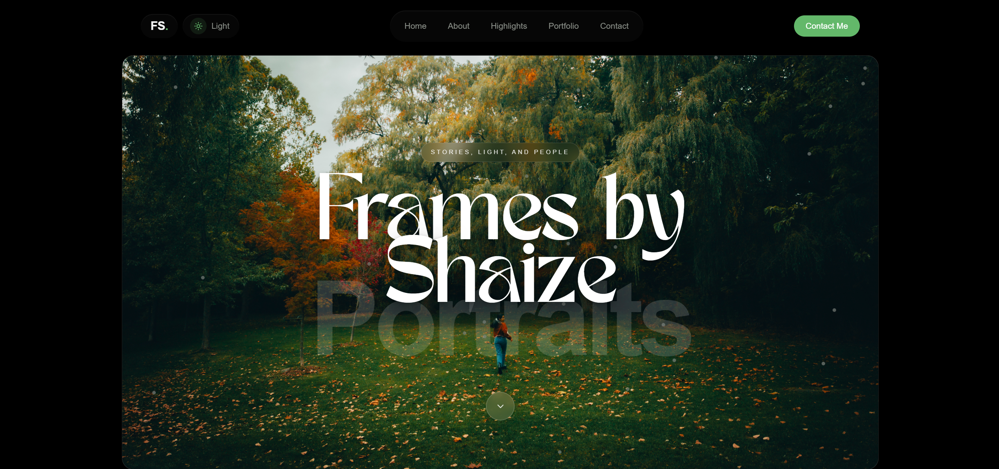

# Frames by Shaize

A modern photography portfolio website built with **React, Vite, and Tailwind CSS**, designed to showcase portrait and landscape photography with a clean cinematic aesthetic.

The site is built as both a **personal brand website** and a **frontend portfolio project** demonstrating responsive UI design, component architecture, and modern deployment workflows.

## Live Website
https://framesbyshaize.com

## Preview



*(Optional: you can add a screenshot later)*

---

# Features

• Fully responsive layout optimized for desktop, tablet, and mobile  
• Dark / Light theme toggle with persistent preference  
• Interactive portrait portfolio slider  
• Image lightbox preview for viewing photos in detail  
• Contact form integration using Web3Forms  
• Smooth UI animations and transitions  
• Glass-style navigation UI with backdrop blur  
• Custom typography and visual hierarchy  
• Production deployment with custom domain  

---

# Tech Stack

Frontend
- React
- Vite
- Tailwind CSS
- Lucide React Icons

Deployment
- Vercel

Other Integrations
- Web3Forms (contact form email service)

---

# Project Structure

```text
src
├─ components
│ ├─ Navbar.jsx
│ ├─ Button.jsx
│
├─ sections
│ ├─ Hero.jsx
│ ├─ About.jsx
│ ├─ Highlights.jsx
│ ├─ Portfolio.jsx
│ ├─ Contact.jsx
│
├─ App.jsx
├─ main.jsx
└─ index.css
```

The project uses a **component-based architecture**, separating layout sections and reusable UI components.

---

# Local Development

Clone the repository

git clone https://github.com/YOUR_USERNAME/framesbyshaize.git

Navigate into the project

cd framesbyshaize

Install dependencies

npm install

Start development server

npm run dev

Open in browser

http://localhost:5173

---

# Production Build

Create production build

npm run build

Preview production build locally

npm run preview

---

# Environment Variables

The contact form requires a Web3Forms API key.

Create a `.env` file in the project root:

VITE_WEB3FORMS_ACCESS_KEY=your_api_key_here

For production deployment, add the same variable inside **Vercel Environment Variables**.

---

# Deployment

This project is deployed using **Vercel**.

Deployment workflow:

1. Push project to GitHub
2. Import repository into Vercel
3. Add environment variables
4. Connect custom domain
5. Deploy

Custom domain used:

framesbyshaize.com

---

# Purpose of the Project

This project was created to:

• showcase photography work professionally  
• demonstrate frontend development skills  
• serve as a portfolio project for React developer roles  

It focuses on **clean UI design, smooth interactions, and production-ready deployment.**

---

# Author

**John Shaize**

Toronto, Canada

Instagram  
https://instagram.com/framesbyshaize

Portfolio  
https://framesbyshaize.com

GitHub  
https://github.com/YOUR_USERNAME

---

# License

This project is for portfolio and educational purposes.